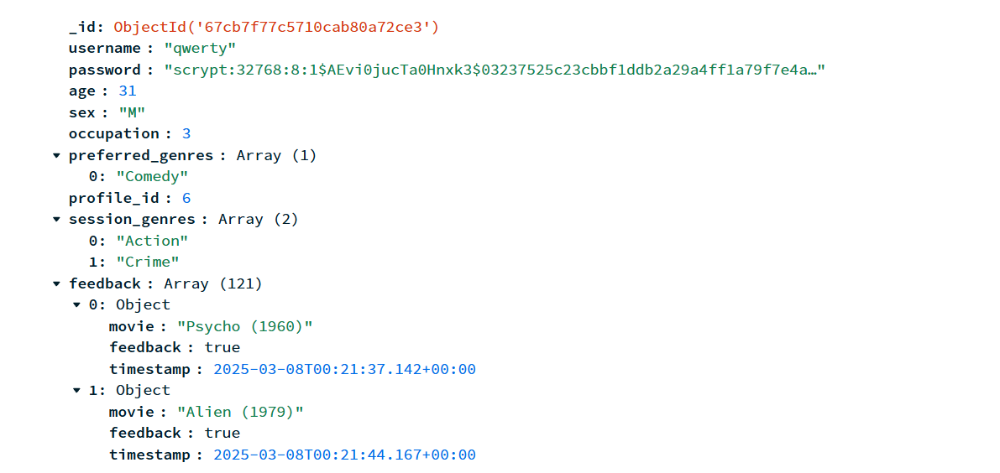
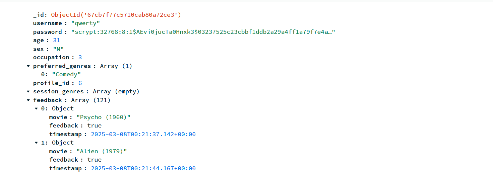
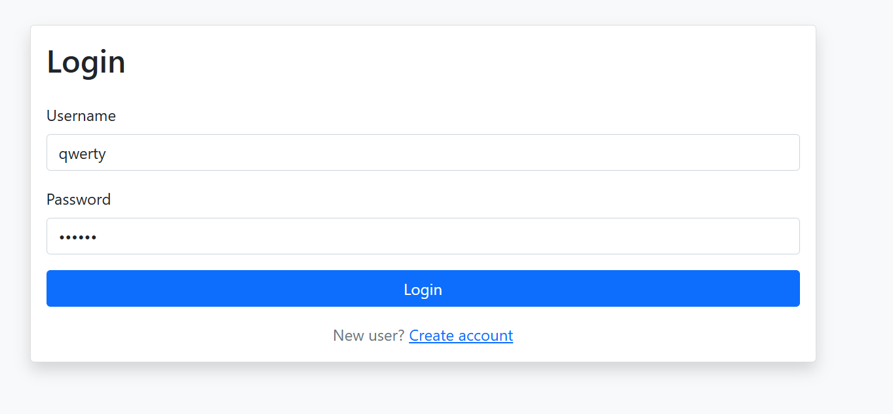
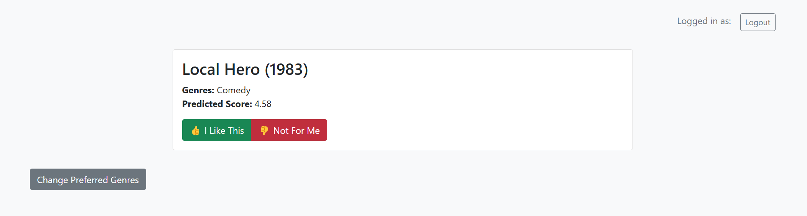
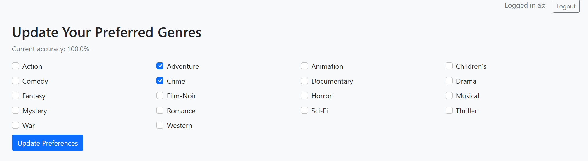
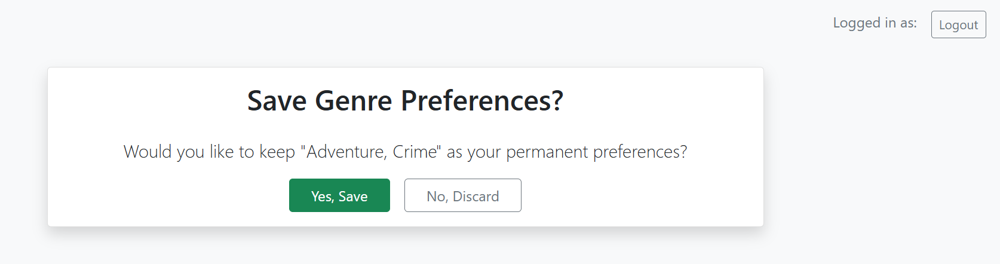
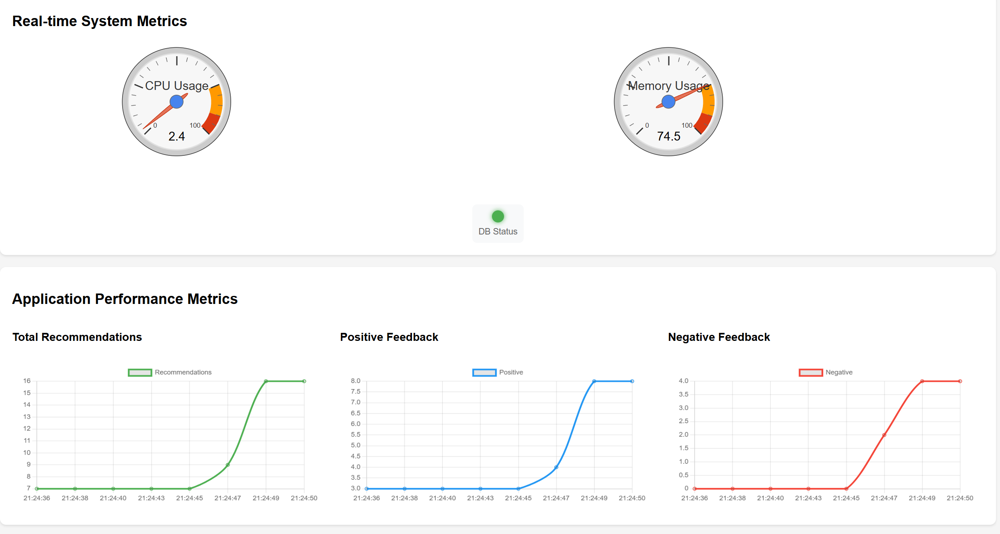

# Hybrid Movie Recommendation System


## Features
1. User authentication (login and registration)
2. Update preferred genres
3. Personalized movie recommendations
4. Feedback system to improve recommendations
5. Metrics dashboard for system monitoring
6. MongoDB integration for data storage
7. Real-time system metrics (CPU and memory usage)


## Install Dependencies :
```bash
pip install -r requirements.txt

```
## How to Run The System :
1. Run app.py on your system first 

```bash
python app.py
```
Open your web browser and go to http://127.0.0.1:5000

2. Create an account and login
3. Give feedbacks, change genres, etc
4. Only logout using the 'logout' button as it will alert you to either save your session profile or discard it

## Note : It is preferable to run the code in VScode rather than Colab notebook. 
If in any case there is an error due to site running on wrong port, change the last line to app.run(debug=False, use_reloader = False) instead of app.run(debug=True, use_reloader = False)

## How to Monitor the Metrics : 

1. While app.py is running on one instance, run dashboard.py on other terminal

```bash
python dashboard.py
```
Open your web browser and go to http://127.0.0.1:5001


## Database :

The session genre is activated when the user wants to change the genre during recommendation


The session genre gets discarded once the user logs out. The genre in that table is also either discarded or saved as permanat preference


## UI : 
1. ## Login 


2. ## Recommendations


3. ## Updating Genre


4. ## Logout


## Monitoring Dashboard :


